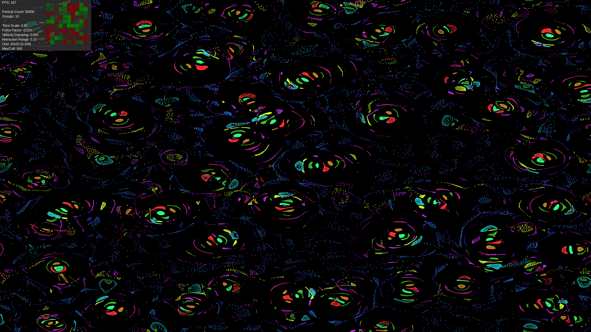

# Particle Life


A real-time 2D particle simulation with group-based interactions



## How it works 
- Each particle has a position, velocity and a color.
- An attraction matrix stored the actraction or repuslion between different colors of particles.
- Every update the forces on a particle get updated via the attraction matrix.


## Requirements
- GPU/driver with OpenGL 4.3+ 
- Java 17+ 

## Run
- Windows (from project root):
```
  - .\gradlew lwjgl3:run
  ```
- Build distributions:
```
  - .\gradlew lwjgl3:distZip
  ```

## Controls
- Right Arrow — Increase time scale 
- Left Arrow — Decrease time scale 
- Up Arrow — Increase force factor 
- Down Arrow — Decrease force factor 
- . (Period) — Increase velocity damping 
- , (Comma) — Decrease velocity damping 
- L — Increase interaction range 
- K — Decrease interaction range 
- Space — Randomize attraction matrix
- 1 — Load preset 1
- 2 — Load preset 2
- 3 — Load preset 3
- 4 — Load preset 4
- R — Reset settings to defaults
- Esc — Exit

## Configuration
- Defaults:  
core/src/main/java/io/github/simulation/config/SimulationConfig.java

- Runtime tuning: 
core/src/main/java/io/github/simulation/config/RuntimeConfig.java (and RuntimeGrid.java)

- Shaders:     
assets/shaders (particle.comp, particle.vert, particle.frag)

